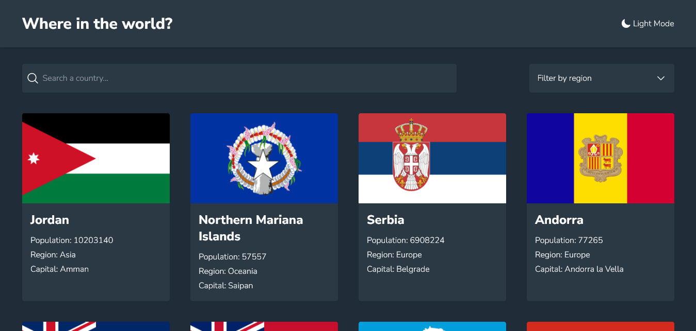
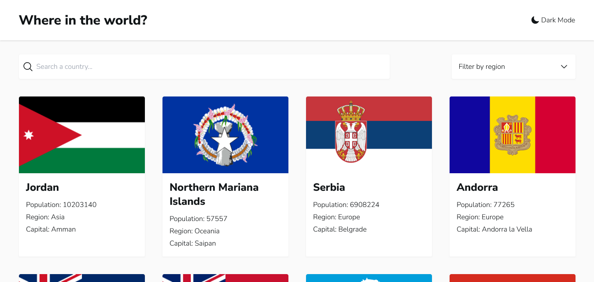

# Frontend Mentor - REST Countries API with color theme switcher solution

This is a solution to the [REST Countries API with color theme switcher challenge on Frontend Mentor](https://www.frontendmentor.io/challenges/rest-countries-api-with-color-theme-switcher-5cacc469fec04111f7b848ca). Frontend Mentor challenges help you improve your coding skills by building realistic projects.

## Table of contents
- [Project Setup](#project-setup)
- [The challenge](#the-challenge)
- [Screenshot](#screenshot)
- [Links](#links)
- [My process](#my-process)
  - [Built with](#built-with)
  - [What I learned](#what-i-learned)
  - [Continued development](#continued-development)
  - [Useful resources](#useful-resources)
- [Author](#author)

## Project setup

```
npm install
```

### Compiles and hot-reloads for development

```
npm run dev
```

### Compiles and minifies for production

```
npm run build
```

### The challenge

Users should be able to:

- See all countries from the API on the homepage
- Search for a country using an `input` field
- Filter countries by region
- Click on a country to see more detailed information on a separate page
- Click through to the border countries on the detail page
- Toggle the color scheme between light and dark mode _(optional)_

### Screenshot

Dark Mode


Light Mode


### Links

- Live Site URL: [See it liveS](https://rest-countries-data-web.netlify.app/)

## My process

### Built with

- TailwindCSS
- Mobile-first workflow
- [React](https://reactjs.org/) - JS library

### What I learned

During the development of this React project, I acquired valuable knowledge and skills. Here are some key takeaways from my experience:

- Utilizing React Router DOM v6: I gained a thorough understanding of the powerful features offered by React Router DOM version 6. By effectively leveraging this library, I was able to create dynamic and responsive navigation within my application, enabling smooth routing and seamless user experiences.

- Implementing Dark and Light Mode: Through the utilization of Tailwind CSS, I successfully integrated a dark and light mode functionality into my project. This feature enhances user accessibility and customization options, allowing users to switch between different visual themes based on their preferences.

- Customizing Tailwind CSS: I familiarized myself with the process of configuring Tailwind CSS according to custom settings. By tailoring the framework to suit the specific requirements of my project, I achieved a more personalized and consistent design system, ensuring a cohesive visual experience across the application.

These learnings have not only expanded my technical capabilities but have also deepened my understanding of building user-friendly and visually appealing React applications. I look forward to applying these newfound skills in future projects and continuing to grow as a developer.

Here are highlights of my code I am really proud of:

```css
.elements {
  @apply bg-lightModeElements dark:bg-darkModeElements;
}

.text {
  @apply text-lightModeText dark:text-darkModeText;
}

.background {
  @apply bg-lightModeBg dark:bg-darkModeBg;
}

.center {
  @apply container mx-auto max-w-7xl px-4 xl:px-2;
}
```

```js
const router = createBrowserRouter(
  createRoutesFromElements(
    <Route path="/" element={<RootLayout />} loader={getTheme}>
      <Route
        index
        element={<Home />}
        loader={HomeLoader}
        errorElement={<ErrorPage />}
      />
      <Route
        path="details/:cca"
        element={<Details />}
        loader={detailsLoader}
        errorElement={<ErrorPage />}
      />
    </Route>
  )
);
```

### Continued development

In future projects, I will focus on the following areas to further refine my skills:

- Advanced React Concepts: Explore advanced state management, hooks, and performance optimization.
- Responsive Design: Master media queries, flexbox, and CSS grid for seamless cross-device experiences and TailwindCSS
- Backend Integration: Gain experience with Express.js, Node.js, and databases for full-stack development.

### Useful resources

- [React docs](https://react.dev) - This helped me real greatly
- [React Router docs](https://reactrouter.com/en/main) - Helped me to understand the features of the React Router

## Author

- Twitter - [@dev_benedict](https://www.twitter.com/dev_benedict)
- LinkedIn - [Benedict Umeozor](https://www.linkedin.com/in/benedict-umeozor-014b70228)
